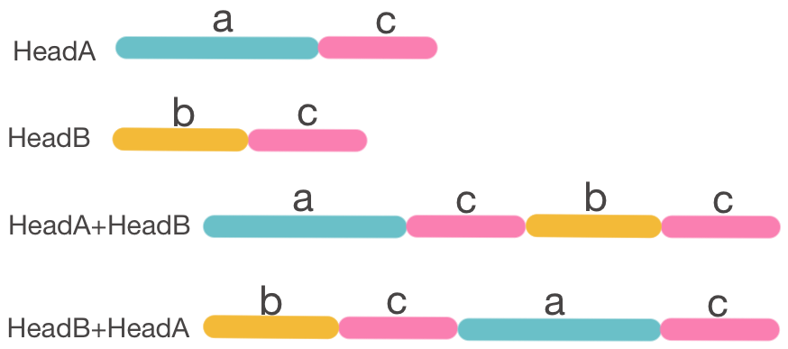

###  160. Intersection of Two Linked Lists


#### 题目描述

Write a program to find the node at which the intersection of two singly linked lists begins.

For example, the following two linked lists:


begin to intersect at node c1.

 

**Example 1:**


```
Input: intersectVal = 8, listA = [4,1,8,4,5], listB = [5,0,1,8,4,5], skipA = 2, skipB = 3
Output: Reference of the node with value = 8
Input Explanation: The intersected node's value is 8 (note that this must not be 0 if the two lists intersect). From the head of A, it reads as [4,1,8,4,5]. From the head of B, it reads as [5,0,1,8,4,5]. There are 2 nodes before the intersected node in A; There are 3 nodes before the intersected node in B.
```

 

**Example 2:**


```
Input: intersectVal = 2, listA = [0,9,1,2,4], listB = [3,2,4], skipA = 3, skipB = 1
Output: Reference of the node with value = 2
Input Explanation: The intersected node's value is 2 (note that this must not be 0 if the two lists intersect). From the head of A, it reads as [0,9,1,2,4]. From the head of B, it reads as [3,2,4]. There are 3 nodes before the intersected node in A; There are 1 node before the intersected node in B.
```

 

**Example 3:**


```
Input: intersectVal = 0, listA = [2,6,4], listB = [1,5], skipA = 3, skipB = 2
Output: null
Input Explanation: From the head of A, it reads as [2,6,4]. From the head of B, it reads as [1,5]. Since the two lists do not intersect, intersectVal must be 0, while skipA and skipB can be arbitrary values.
Explanation: The two lists do not intersect, so return null.
```

 

**Notes:**

- If the two linked lists have no intersection at all, return `null`.

- The linked lists must retain their original structure after the function returns.

- You may assume there are no cycles anywhere in the entire linked structure.

- Your code should preferably run in O(n) time and use only O(1) memory.

  

#### 思路

- 用两个指针cur1，cur2从头同时遍历A，B两个链表，当两个链表相交时应该有cur1==cur2!=null，如果没有则不相交。链表长度相等时遍历一次即可，如果长度不相等，当cur1到达终点时，开始遍历B，当cur2到达终点时，开始遍历A，可以证明最多经过两次遍历即可完成判断。




  

  如图，将两个链表表示为a+c和b+c，c是相交的部分（c的长度可以是0）。遍历完两个链表，一定会从某个节点开始有cur1==cur2，如果c不存在则有cur1==cur2==null

  

#### 代码

```Java
public class Solution {
    public ListNode getIntersectionNode(ListNode headA, ListNode headB) {
        if (headA == null || headB == null) return null;
        ListNode cur1 = headA; ListNode cur2 = headB;

        while (cur1 != cur2) {
            cur1 = cur1 == null ? headB : cur1.next;
            cur2 = cur2 == null ? headA : cur2.next;
        }
        return cur1;
    }
}
```


